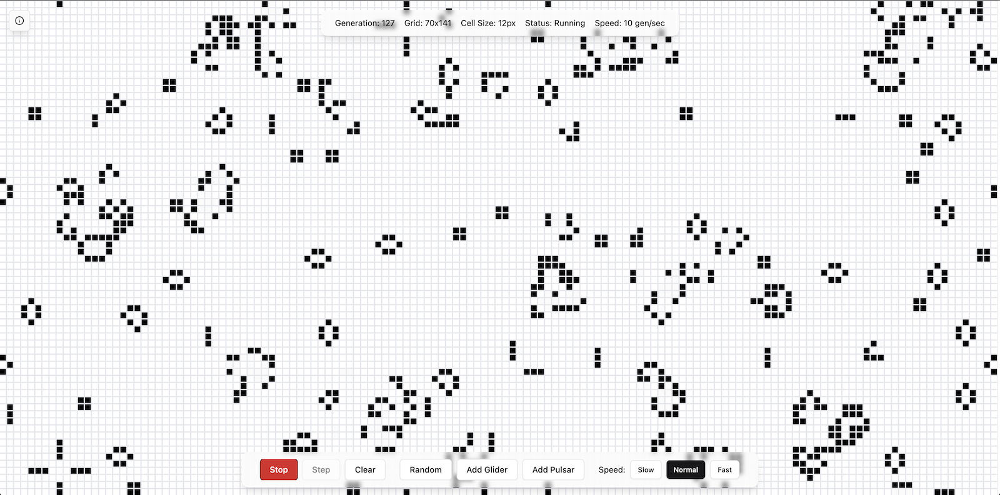

# Conway's Game of Life

An interactive implementation of Conway's Game of Life using Svelte and Tailwind CSS.



## Features

- Responsive grid
- Adjustable simulation speed
- Pre-built patterns (Glider, Pulsar)
- Status display showing grid dimensions and generation count

## About Conway's Game of Life

Conway's Game of Life is a cellular automaton devised by mathematician John Conway in 1970. It follows simple rules:

1. Any live cell with 2 or 3 live neighbors survives
2. Any dead cell with exactly 3 live neighbors becomes alive
3. All other cells die or remain dead

These simple rules create complex emergent patterns and behaviors.

## Development

Once you've cloned the project and installed dependencies with `npm install`, start a development server:

```bash
npm run dev

## Building

To create a production version of your app:

```bash
npm run build
```

You can preview the production build with `npm run preview`.

## License

[](https://opensource.org/licenses/MIT)